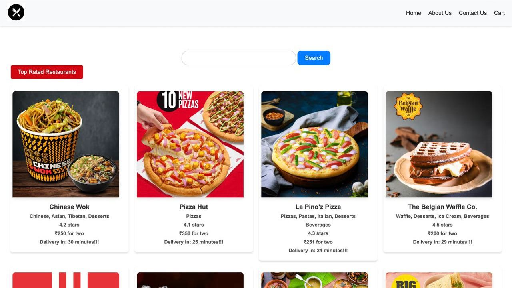
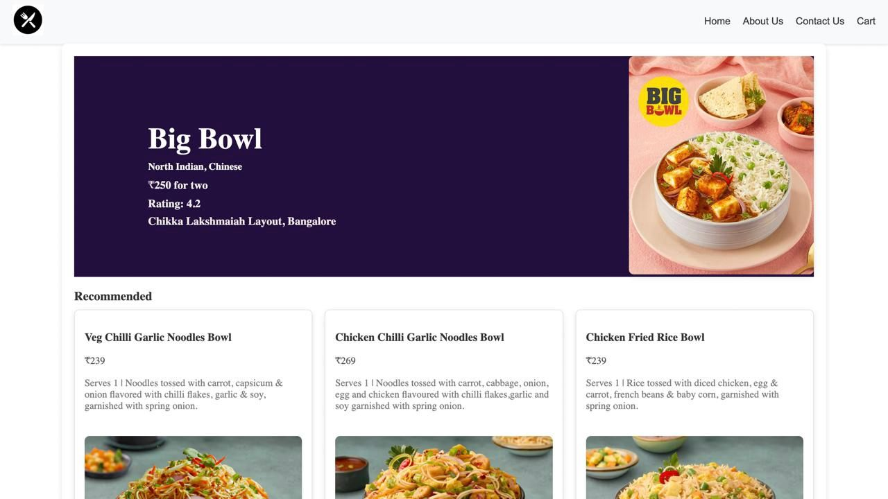
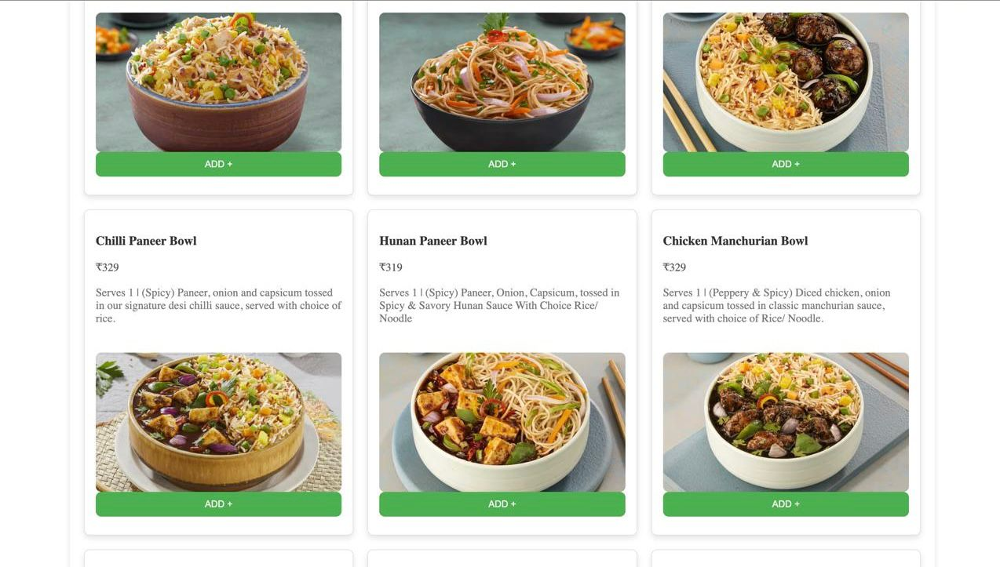

# Food90

Food90 is a food ordering application built using React. It fetches data from Swiggy's live API to display various restaurants and their menus. The application uses Parcel as a bundler, custom hooks for state management, and vanilla CSS for styling.

## Features

- **Live Data:** Fetches real-time data from Swiggy's API.
- **Custom Hooks:** Utilizes custom hooks for efficient state management.
- **Vanilla CSS:** Styled with vanilla CSS for a clean and responsive design.
- **Parcel Bundler:** Uses Parcel for bundling the application.

## Screenshots

    
    

